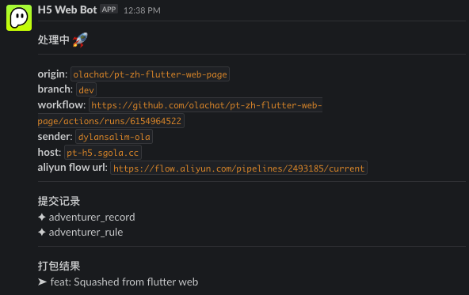
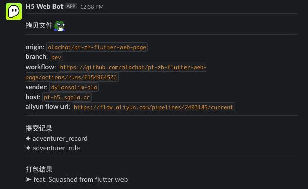
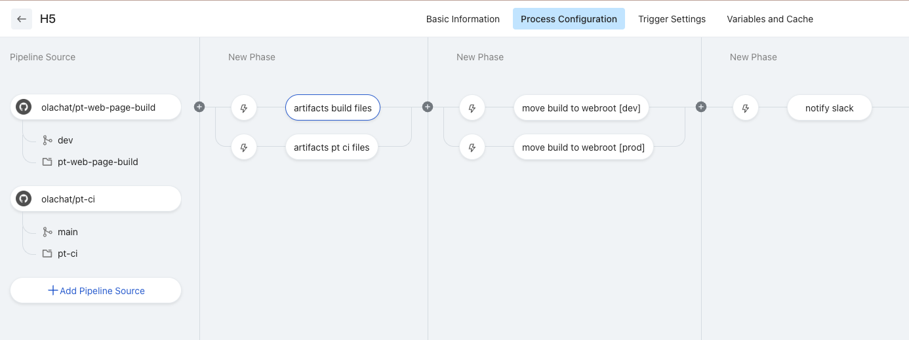

> PT Flutter Web自动部署

<!-- more -->

# PT Flutter Web自动部署
- PT Flutter web新的代码库： https://github.com/olachat/pt-zh-flutter-web-page
- PT Flutter web 打包后的代码库（包含build文件）：https://github.com/olachat/pt-web-page-build
- Github Actions yaml: https://github.com/olachat/pt-zh-flutter-web-page/blob/master/.github/workflows/build.yaml
- Aliyun flow: https://flow.aliyun.com/pipelines/2493185/current
- 新flutter web 域名：
  -   https://page.partying.tw/flutter/pt/ （线上）
  -   https://page.partying.chat/flutter/pt/ （线上，国内域名）
  -   https://page.partying.dev/flutter/pt/ (dev)
- 部署事件bot: partying-web-bot (可以找 Dylan Salim 石田 要求slack channel权限)

## 自动部署使用指南：
只需要pr进master或者dev就会自动部署

## 自动部署flow：
1. 新flutter web的github actions会聆听beta和dev分支，Master 和dev 分支都需要以pr的方式提交代码。    
Github actions 的代码请查看 [action](https://github.com/olachat/pt-zh-flutter-web-page/blob/master/.github/workflows/build.yaml)  
如果有新的commit，便会通知partying-web-bot的slack群。

1. Flutter web的打包动作会由github actions去触发，调用我们客户端的打包机器去打包文件。  
打包的脚本: https://github.com/olachat/pt-zh-flutter-web-page/blob/master/.github/workflows/scripts/build-prod.sh

2. 打包完成后，actions会上载至另一个打包后的代码库, [pt-web-page-build](https://github.com/olachat/pt-web-page-build/tree/master) (用法和web-page-flutter的代码库相似)。

3. 在上载build文件后， github actions 会触发一个webhook通知云效。  
   云效在收到请求后，会搬运文件去我们新的pt-h5的机器。  
   搬运的branch名是通过webhook param传的。(都在github actions里)  
   阿里云云效: https://flow.aliyun.com/pipelines/2493185/current  
   发送webhook后，会更新之前的slack信息

4. 云效搬运好后，会更新之前的slack信息

- 云效flow config

## FAQ
1. 云效里有什么功能？为什么使用云效而不是使用 `scp` 拷贝去部署机器？  
A: 云效只有拷贝文件和通知slack部署已经完成的功能  
   此功能也能使用 `scp` 完成，`scp`也会比云效快  
   我们这次的自动部署功能改用云效是因为安全考量，不把机器ssh token存在github里

