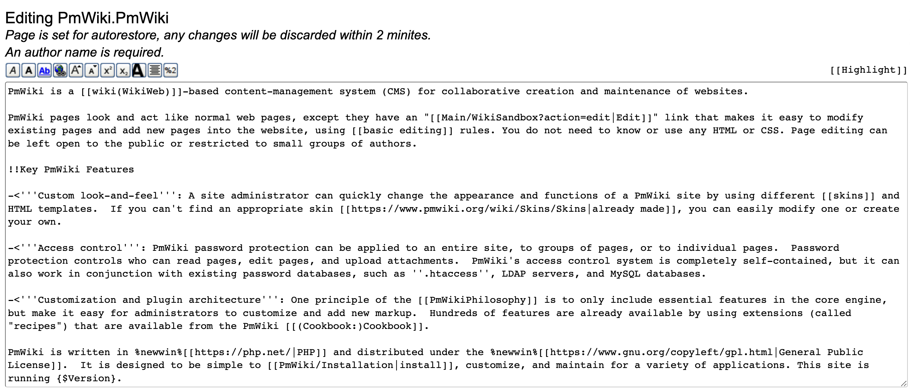
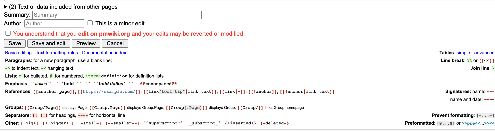

======= ARCHIVE =======
# Old Discussion Archive
-- The bottom part is no longer relevant at this point
## Todo
Implement a wiki page and BookStack. Define the wiki & BookStack roles and rules

## Details of Todo:
[ ] - POC on wiki to choose
[ ] - Try Setup, find useful plugins to include, Deploy
[ ] - Setup rules and roles in the wiki
[ ] - POC on Tech Documentation implementation/others better solutions
[ ] - Try Setup, find useful plugins to include, Deploy
[ ] - Setup rules and roles in the Tech Documentation

## Criteria for Wiki:
1. Easy to edit, easy syntax recommendation

1. Role Permission to edit or view only, allow login

## Wiki Recommendations
1. [MediaWiki](https://www.mediawiki.org/wiki/MediaWiki)
Example: [Wikipedia](https://www.wikipedia.org/)
Tech Stack: PHP
2. [PmWiki](https://www.pmwiki.org/wiki/PmWiki/PmWiki)
Tech Stack: PHP
3. [DocuWiki] (https://www.dokuwiki.org/dokuwiki)
Example: 
Tech Stack: PHP
4. [Wiki.js](https://docs.requarks.io/install/config)
Tech Stack: NodeJS

## Criteria for Tech Documentation:
1. All users can create new books
2. All users can comment on existing book
3. Login feature to disable outsider to enter
   
## Tech Documentation Recommendations
1. BookStack
Example: [BookStack Demo](https://demo.bookstackapp.com/)
[Language Setup Guide](https://www.bookstackapp.com/docs/admin/language-config/)
1. [Hexo](https://hexo.io/) - Disadvantage (it is public and requires minor coding)
Example: [here](https://dylansalim-ola.github.io/tech-documentation/)
[repo](https://github.com/dylansalim-ola/tech-documentation/)

## Open for discussion
Links:
https://geekflare.com/self-hosted-wiki-software/

## Current Documentations
- [Bumblebee](https://github.com/olachat/bumblebee/blob/main/docs/code_review_guideline/01.General_Guides.md) 
- [Ola Youtube](https://www.youtube.com/playlist?list=PLoPO3cY_SOHn5Y207wg-CGAhPL9457r_E)
======= ARCHIVE =======