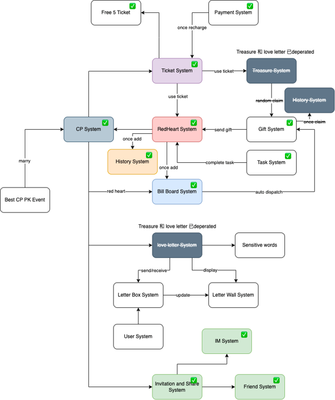

>Wiki Implementation

<!-- more -->
# Wiki & Tech Documentation
Wiki Link: https://github.com/olachat/veeka/wiki
## Background
Knowledge sharing and documentation play a crucial role in organizations, as they facilitate the transfer of information, best practices, and lessons learned. Currently, we didn't use our wiki good enough, most of the time our knowledge is scattered across various systems, files, and individuals, it becomes difficult to locate and access relevant information.    

## Aim 
* To create a centralized, general purpose repository of knowledge for all employees in SG team (current state, may be expanded to all in the future)
* Allows employees to share expertise, document processes, and collaborate on projects
* Fosters a culture of continuous learning and knowledge exchange, enabling the company to retain institutional knowledge and improve efficiency.
* One stop wiki for all, wiki shouldn't include extensive tech stuff, but links to guides (included with tags for easy searching)

### Criteria for Tech Wiki 
1. Purpose and Scope: Clearly define the purpose, audience, and topics covered in the tech team wiki.  
  
2. Structure and Organization: Create a well-organized structure with categories, headings, and a table of contents/index for easy navigation.

3. Collaboration and Access Control: Enable team members to contribute while maintaining appropriate access controls.

4. Documentation Guidelines: Establish standards for consistent formatting and style.

5. Code Snippets and Examples: Include code examples and tutorials to illustrate best practices.

6. Troubleshooting and FAQs: Provide guides and solutions for common issues and frequently asked questions.

7. Tools and Technology Documentation: Document installation, configuration, and usage of tools and technologies used by the team.

8. Knowledge Sharing Initiatives: Encourage team members to share their expertise and reward contributions.

9.  Regular Updates and Maintenance: Assign responsibility for updating and reviewing content to ensure accuracy.

10. Training and Onboarding: Use the wiki as a resource for training new team members and onboarding them effectively.

### Stakeholder
- All employees (Internal tech first, then expand)

## This wiki documentation may consist of 2 parts:
1. General Purpose Wiki - Includes links to docs, short guides (extensive tech documentations should not be included in this wiki)
2. Tech Documentation - Includes tech-only extensive documentation (Inside the Veeka REPO)

### Discussion point
1. Would you benefit from this wiki/tech docs? What can we enhance?
2. An architecture diagram does help to give an overall picture of a system flow. Do we need to setup a workflow where backend and frontend developers sit down and develop such diagram for future reference?

3. Discussion point on the implementation of tech wiki from ChatGPT
```
One important discussion point when implementing a tech wiki could be the process and guidelines for creating and maintaining the wiki. Here are some potential discussion points to consider:

1. Objectives and Scope: Discuss the specific objectives of the tech wiki. Identify the scope of information to be included, such as documentation, best practices, coding standards, project guidelines, troubleshooting guides, or tool documentation.

2. Roles and Responsibilities: Determine the roles and responsibilities within the team for creating, reviewing, and maintaining the wiki content. Assign individuals or teams to oversee different sections or categories of the wiki to ensure accountability and ownership.

3. Content Creation Guidelines: Establish guidelines for creating content in the wiki. Discuss formatting standards, use of templates, and best practices for organizing and structuring information. Consider including guidelines for documenting code snippets, diagrams, and examples.

4. Review and Approval Process: Define a review and approval process for the wiki content to ensure accuracy and quality. Discuss how team members can contribute to content review and how to handle conflicts or disagreements during the review process.

5. Documentation Updates and Maintenance: Discuss how the wiki will be kept up to date. Determine the frequency of updates and establish a process for maintaining the accuracy and relevance of the information over time. Identify individuals or teams responsible for monitoring and updating the wiki content.

6. Knowledge Sharing Culture: Encourage a culture of knowledge sharing within the team. Discuss the importance of actively contributing to the wiki and how it benefits the team's overall productivity and efficiency. Encourage team members to share their expertise, lessons learned, and new insights through the wiki.

7. Integration with Workflows and Processes: Explore how the tech wiki can integrate with existing workflows and processes within the team. Discuss how team members can easily access and reference the wiki during their day-to-day tasks. Consider integrating the wiki with project management tools, code repositories, or communication platforms to enhance collaboration and streamline processes.

8. Training and Onboarding: Discuss how new team members will be introduced to the tech wiki. Consider providing training or onboarding sessions to familiarize them with the wiki's purpose, structure, and usage. Address any questions or concerns regarding the learning curve associated with the wiki platform or processes.

9. Promotion and Adoption: Discuss strategies for promoting and encouraging adoption of the tech wiki within the team. Consider creating awareness through team meetings, presentations, or regular updates. Highlight the benefits of using the wiki and showcase success stories to motivate team members to actively engage with it.

10. Feedback and Improvement: Establish a feedback mechanism to continuously improve the tech wiki. Encourage team members to provide suggestions, report issues, or propose new features for the wiki. Discuss how feedback will be evaluated and incorporated into future iterations of the wiki implementation.

By engaging in discussions around these points, the team can establish clear guidelines, expectations, and processes for successfully implementing and maintaining the tech wiki, fostering effective knowledge sharing and collaboration within the team.
```

Feel free to leave comments down below if you have any questions or comments